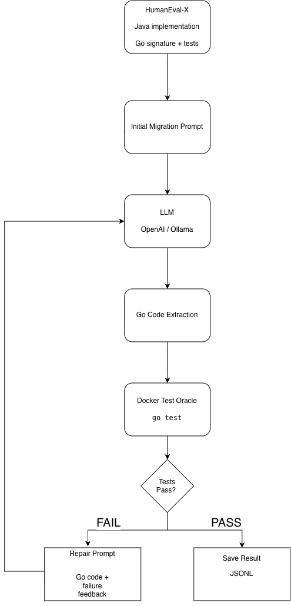
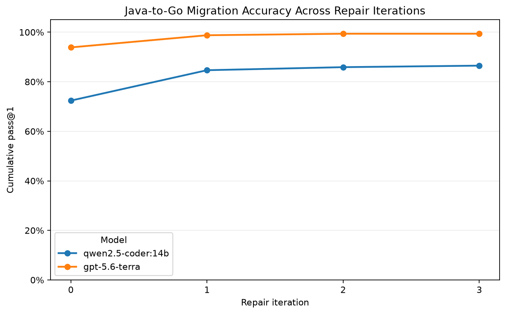
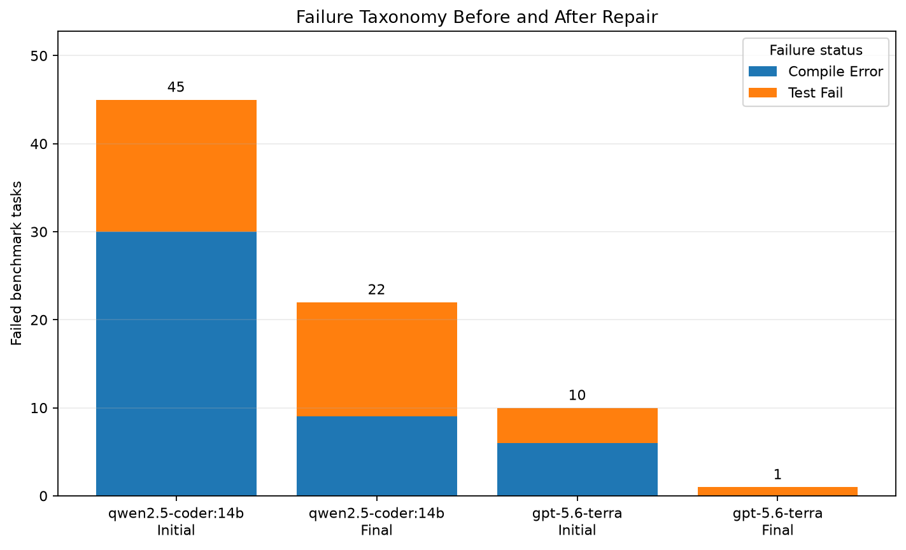

# migrate-eval

LLM-assisted code migration with executable tests as the correctness oracle.

`migrate-eval` is a Python evaluation harness that uses an LLM to migrate code from Java to Go and executes the generated Go implementation inside a sandboxed Docker environment. It feeds compiler and test failures back to the model and measures how the pass rate changes across repair iterations.

The project grew out of a real C# → Go migration that I worked on and explores a simple question:

**How reliably can an LLM migrate code between languages, and how much does test-driven repair improve the result?**

For the evaluation, I currently use the Java and Go subsets of HumanEval-X.

---

## Architecture



```text
migrate-eval/
├── README.md
├── pyproject.toml
├── Makefile
├── Dockerfile.go
├── data/
│   └── humaneval_x/
├── src/migrate_eval/
│   ├── dataset.py
│   ├── prompts.py
│   ├── extract.py
│   ├── runner.py
│   ├── loop.py
│   ├── results.py
│   ├── costs.py
│   ├── cache.py
│   ├── cli.py
│   └── models/
│       ├── base.py
│       ├── openai_adapter.py
│       └── ollama_adapter.py
├── scripts/
│   ├── fetch_data.py
│   ├── validate_oracle.py
│   └── plot_results.py
├── results/
├── docs/
└── tests/
```

The main components are intentionally separated:

- `dataset.py` — HumanEval-X loading and Java/Go problem pairing
- `prompts.py` — initial migration and repair prompts
- `models/` — interchangeable model adapters
- `extract.py` — Go source extraction and package normalization
- `runner.py` — sandboxed Docker execution
- `loop.py` — migration → test → repair orchestration
- `results.py` — JSONL persistence and evaluation aggregation
- `cache.py` — persistent completion cache
- `costs.py` — API cost estimation and run protection
- `cli.py` — command-line interface

## How It Works

For each benchmark problem, the dataset loader first provides the Java implementation, the required Go function declaration, and the Go tests.

The migration prompt then asks the model to implement the Java behavior in Go, and the generated Go source is extracted from the model response.

After that, the implementation is executed against the HumanEval-X Go tests inside Docker.

If the code fails to compile or the tests fail, the failure output is sent back to the model in a repair prompt.

The process stops when the generated code passes the tests or when the configured repair limit is reached. Every attempt is saved to JSONL so the results can be analyzed later.

---

## Results

For the evaluation, I used 163 Java → Go migration tasks.

- `Go/95` was excluded because its canonical Go implementation is nondeterministic due to Go map iteration order.
- Iteration 0 is the initial migration.
- Iterations 1–3 are test-driven repair attempts.

### Pass@1 by Repair Iteration

| Model | Iteration 0 | Iteration 1 | Iteration 2 | Iteration 3 | Improvement | Initial Failures Repaired |
|---|---:|---:|---:|---:|---:|---:|
| GPT-5.6 Terra | 93.9% | 98.8% | 99.4% | 99.4% | +5.5 pp | 9/10 (90.0%) |
| Qwen2.5-Coder 14B | 72.4% | 84.7% | 85.9% | 86.5% | +14.1 pp | 23/45 (51.1%) |

GPT-5.6 Terra achieved the stronger overall performance:

- 153/163 tasks passed on the initial migration
- 162/163 passed after repair
- 9/10 initial failures were repaired

Qwen2.5-Coder 14B benefited more in absolute percentage points:

- 118/163 tasks passed initially
- 141/163 passed after repair
- 23/45 initial failures were repaired

For both models, most of the repair gains happened during the first repair iteration.

### Pass Rate vs Repair Iteration



### Failure Taxonomy

Initial failures:

| Model | Compile Error | Test Fail | Total |
|---|---:|---:|---:|
| GPT-5.6 Terra | 6 | 4 | 10 |
| Qwen2.5-Coder 14B | 30 | 15 | 45 |

Final failures:

| Model | Compile Error | Test Fail | Total |
|---|---:|---:|---:|
| GPT-5.6 Terra | 0 | 1 | 1 |
| Qwen2.5-Coder 14B | 9 | 13 | 22 |



The local Qwen model started with more compilation failures. The repair loop reduced them from 30 to 9, while test failures were harder to fully eliminate.

GPT-5.6 Terra started much closer to the benchmark ceiling and repaired all of its initial compilation failures.

---

## Telemetry

| Model | Attempts | Fresh Attempts | Cache Hits | Input Tokens | Output Tokens | Mean Fresh Latency |
|---|---:|---:|---:|---:|---:|---:|
| GPT-5.6 Terra | 176 | 176 | 0 | 60,917 | 34,052 | 3.980 s |
| Qwen2.5-Coder 14B | 256 | 227 | 29 | 101,202 | 32,010 | 5.070 s |

For Qwen, cached attempts reuse the completion associated with an identical model and prompt pair. Fresh-call latency therefore excludes attempts where `cache_hit == true`.

The full GPT-5.6 Terra evaluation had an estimated API cost of about **$0.53** for the 163-problem benchmark with up to three repair iterations.

---

## Installation

### Requirements

- Python 3.11+
- Docker
- Go Docker image built through the project setup
- Ollama for local-model evaluation
- an OpenAI API key for OpenAI evaluation

Clone the repository and run:

```bash
make setup
```

Activate the environment:

```bash
source .venv/bin/activate
```

Run the test suite:

```bash
make test
```

---

## Running an Evaluation

### Local Ollama Model

```bash
migrate-eval run \
  --model ollama:qwen2.5-coder:14b \
  --n 10 \
  --iters 3
```

### OpenAI Model

Set an API key in the environment:

```bash
export OPENAI_API_KEY="your-key"
```

Then run:

```bash
migrate-eval run \
  --model openai:gpt-5.6-terra \
  --n 10 \
  --iters 3 \
  --workers 4 \
  --max-cost 1.00
```

Important options:

- `--n` — number of benchmark problems
- `--iters` — maximum number of repair rounds
- `--workers` — number of benchmark problems evaluated concurrently
- `--max-cost` — soft API-cost safety limit

`--iters 0` performs only the initial migration.

`--iters 3` permits:

```text
iteration 0 — initial migration
iteration 1 — first repair
iteration 2 — second repair
iteration 3 — third repair
```

The loop stops immediately when a task passes.

---

## Results and Reproducibility

Each evaluation creates:

```text
results/<model>/<run_id>.jsonl
results/<model>/<run_id>.meta.json
```

The JSONL file stores every model attempt, including:

- benchmark task
- model
- repair iteration
- prompt
- raw response
- extracted Go code
- execution status
- compiler/test output
- Docker execution duration
- model latency
- input/output token counts
- cache-hit status

The metadata file records the run configuration, including:

- model
- repair limit
- selected tasks
- benchmark exclusions
- model temperature configuration
- prompt hash
- worker count
- cost safety limit

Model completions are cached using:

```text
model name + exact prompt
```

This means identical reruns can reuse a previous completion instead of repeating the same paid or local inference.

---

## Test Oracle and Sandboxing

LLM-generated code is never executed directly on the host machine.

Every Go implementation runs inside Docker with:

- non-root execution
- 1 CPU limit
- 512 MB memory limit
- runtime network disabled
- read-only container filesystem
- read-only host source mount
- temporary writable build workspace
- execution timeout
- forced termination of runaway containers

The execution result is classified as one of:

```text
PASS
COMPILE_ERROR
TEST_FAIL
TIMEOUT
EXTRACT_ERROR
MODEL_ERROR
```

These statuses are also used for the failure taxonomy in the evaluation.

---

## Oracle Validation

Before evaluating model-generated code, I validated the Go runner against the canonical HumanEval-X Go implementations.

Raw result:

```text
163 / 164 canonical solutions PASS
```

The remaining task was:

```text
Go/95 — CheckDictCase
```

Its canonical implementation depends on Go map iteration order and can return different results depending on the order in which map keys are visited.

It was therefore excluded from the evaluation benchmark.

Final validated benchmark:

```text
163 / 163 canonical solutions PASS
```

This gave me a validated set of 163 tasks to use for the model evaluation.

---

## Repair Strategy

The initial prompt contains:

- the Java implementation
- the exact required Go function signature

It does not expose:

- the canonical Go implementation
- the HumanEval-X target tests

When a generated migration fails, the repair prompt receives:

- the current Go implementation
- failure status
- compiler/test stdout
- compiler/test stderr

Failure feedback is truncated to around 60 output lines to control the prompt size.

The current repair configuration does not include the original Java implementation again during repair. Comparing repair prompts with and without the original source is something I would like to test separately.

---

## Evaluation Metric

The main metric is cumulative **pass@1 at iteration i**.

It represents the fraction of benchmark problems that have produced a Go implementation passing all target tests by repair iteration `i`.

A task that passes on iteration 1 therefore also counts as passed at iterations 2 and 3.

This lets me measure both the initial migration performance and the additional improvement provided by compiler/test-driven repair.

---

## Limitations

The benchmark results should not be interpreted as proof that the same models can automatically migrate a large production system.

### Small benchmark programs

HumanEval-X mostly contains small standalone programming problems. Real migrations involve larger codebases, dependencies, state, persistence, APIs, configuration, build systems, and architectural constraints.

### Possible training-data contamination

HumanEval-X is a public benchmark and its problems may have appeared in model training data.

The evaluation therefore measures model and repair-loop behavior on this benchmark. It does not establish uncontaminated general code-migration capability.

### Tests define correctness

The harness treats the target-language test suite as the behavioral oracle.

An implementation can only be considered correct relative to the behaviors exercised by those tests.

### One migration direction

The current benchmark evaluates:

```text
Java → Go
```

The harness can support additional language pairs, but they have not been evaluated here.

### Local-model reproducibility

The local Ollama model uses deterministic settings where supported, but results may still vary slightly between runs or environments.

### Repair ablation not yet measured

The full benchmark uses repair feedback without re-supplying the original Java source.

A controlled comparison of repair prompts with and without the Java implementation has not yet been performed.

---

## Example Repair Trace

A real GPT-5.6 Terra evaluation on `Go/2` produced:

```text
iteration 0 — COMPILE_ERROR
iteration 1 — TEST_FAIL
iteration 2 — PASS
```

The first implementation attempted an invalid floating-point remainder operation.

Compiler feedback allowed the model to fix the compilation problem, but the next version was still behaviorally incorrect.

The target tests then exposed the semantic error, and the second repair produced a passing implementation.

The complete trace is documented in:

```text
docs/repair-traces/gpt-5.6-terra-go2.md
```

The repair loop in this example was:

```text
generate
→ execute
→ observe failure
→ repair
→ execute again
```

---

## Next Steps

Potential extensions include:

- repair prompt comparison with vs without the original Java source
- C++ → Go evaluation using the same harness
- evaluation on more realistic multi-function migration tasks
- additional model adapters
- cost per successfully migrated problem
- static checks such as `go vet`
- evaluation on larger repository-level migrations

I left these outside the current scope so I could finish and evaluate the core system first.

---

## Credits

The benchmark uses **HumanEval-X**, released as part of the CodeGeeX project.

HumanEval-X provides equivalent programming tasks across several languages, including the Java source and Go target implementations/tests used in this project.

---

## Licence

`migrate-eval` is released under the **MIT Licence**.

See [`LICENSE`](LICENSE).
